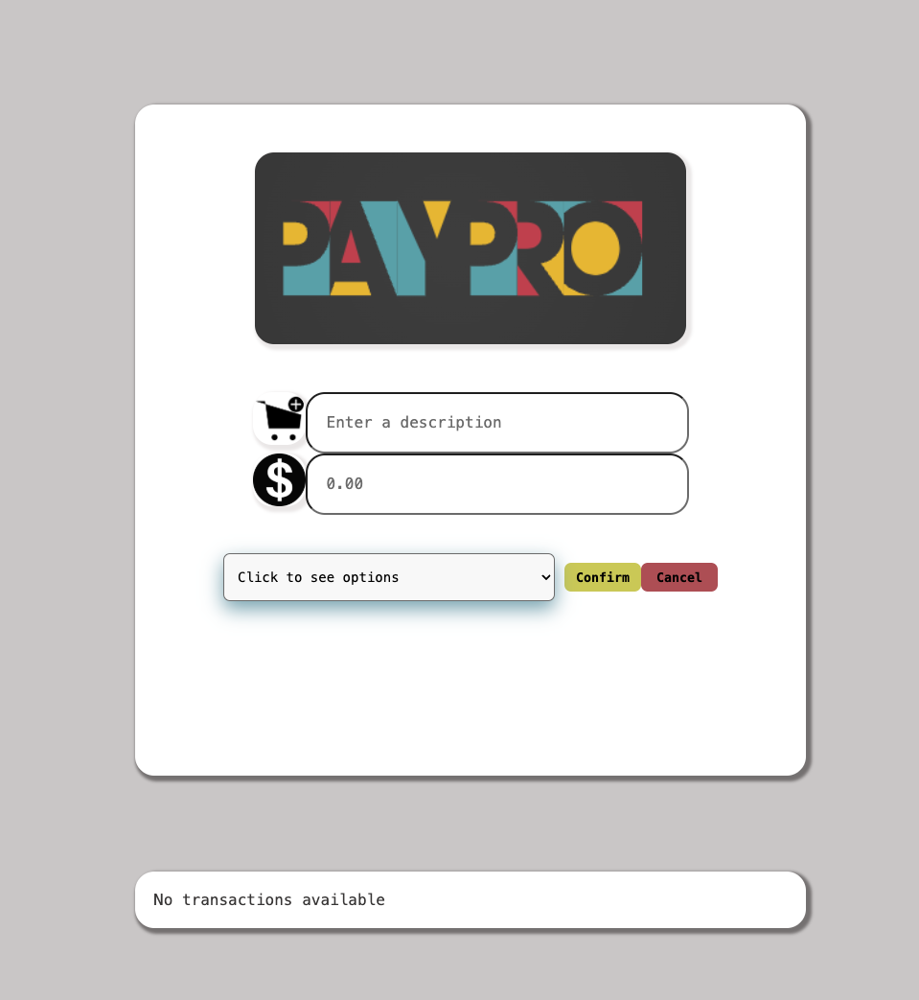

# PayPro


> PayPro is a financial management web application specifically designed to manage and track shared expenses, a task that can often be tedious and complex when handled manually. In many social contexts—whether among roommates, friends, or within families—financial transactions involving shared costs can lead to misunderstandings or imbalances that may strain relationships. PayPro simplifies this process by providing a clear, intuitive platform for recording, monitoring, and settling shared expenses in an equitable manner.


## Core Features

- **User Authentication**: Secure login and registration system to ensure that financial data is accessible only to authorized users.
- **Expense Logging**: Add and track every shared expense with details about who paid and who owes, ensuring everyone is on the same page.
- **Automated Calculations**: The system automatically calculates how much each member owes or is owed, facilitating easy and fair settlements.


## Stretch Goals
- **Notifications**: Automatic reminders for outstanding payments, ensuring that all debts are settled on time.
- **Group Dashboards**: Users can create and manage multiple groups, each with its own unique dashboard for monitoring shared financial activities.


## Technologies Used

- **Frontend**: React.js for a dynamic and responsive user interface.
- **Backend**: Node.js and Express.js to handle API requests and server-side logic.
- **Database**: MongoDB for storing user data and transaction records efficiently.
- **Authentication**: Use bcrypt for secure password hashing. JWT (JSON Web Tokens) setup is in progress for scalable user authentication, but it is not functional yet.
- **Styling**: Utilize CSS and modern UI frameworks like Material-UI for a clean and user-friendly design.

## How to get started

 **Installation**

1. **Clone the repository:**

    ```sh
    git clone https://github.com/Ploynpk/paypro.git
    ```

2. **Navigate into the project directory:**

    ```sh
    cd paypro
    ```

3. **Install the necessary dependencies:**

    ```sh
    npm install
    ```

**Running the Project**

4. **Start the development server:**

    ```sh
    npm start
    ```
   
**Running the Server Terminal**
 To run the server terminal:

1. **Navigate to the server directory:**

    ```sh
    cd server
    ```

2. **Start the server using nodemon:**

    ```sh
    nodemon server.js
    ```

     
 ## Building the Project for Production

To build the project and serve the static files:

1. **Build the project:**

    ```sh
    npm run build
    ```

    This will generate the `dist` directory and the `bundle.js` file.

## Contributing

Contributions are welcome! Please fork the repository and submit a pull request for any improvements.
